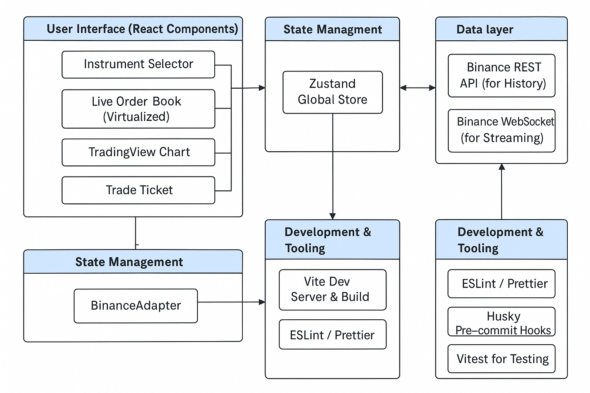

# Trading App

[](https://vercel.com/new/clone?repository-url=https%3A%2F%2Fgithub.com%2FJackey351%2FTradingApp)

A production-grade React + TypeScript SPA for a crypto trading application. This project features real-time data from Binance, a live order book, a TradingView chart, and persistent position tracking.

## Architecture

The application is built with a modular and scalable architecture, separating UI, state management, and data services.

- **User Interface (UI Components)**: Contains all user-facing visual elements, such as the instrument selector, order book, TradingView chart, trade ticket, and positions widget.
- **State Management**: Uses Zustand as a global state manager. All critical application data (like the current trading pair, order book data, and positions) is stored here.
- **Data Layer**: The `BinanceAdapter` is the data adapter responsible for communicating with the Binance API to fetch all trading data.
- **External Data Sources**: Represents the real data sources, namely Binance's REST API (for historical data) and WebSocket (for real-time streaming).
- **Development & Tooling**: Lists the tools that support development, building, and quality assurance, such as Vite, ESLint, and Husky.

### Core Data Flow

- **User Interaction**: User actions on UI components (e.g., selecting a trading pair) trigger updates to the Zustand store.
- **State-Driven UI**: Changes in the Zustand store's data drive the UI components to re-render, displaying the latest data.
- **Data Fetching**: The Zustand store calls the `BinanceAdapter` to subscribe to or fetch data.
- **Data Update**: After the `BinanceAdapter` receives data from the Binance API, it updates the Zustand store, completing the data loop.

## Architecture Diagram



## Core Features

- **Instrument Selector**: Switch between different trading pairs (e.g., BTC/USDT, ETH/USDT).
- **TradingView Chart**: Advanced charting library with custom data feed integration from Binance.
- **Live Order Book**: Real-time, virtualized order book to handle high-frequency updates efficiently.
- **Trade Ticket**: Mock order placement using the best available bid/ask prices.
- **Positions & PnL Widget**: Track your positions and unrealized profit/loss, with data persisted in `localStorage`.
- **Connectivity Resilience**: Robust WebSocket handling with automatic reconnection logic.
- **Strict Code Quality**: Enforced by ESLint, Prettier, and TypeScript with pre-commit hooks.

## Tech Stack

- **Framework**: React 18
- **Language**: TypeScript (≥ 5.3)
- **Build Tool**: Vite 4
- **State Management**: Zustand
- **Styling**: Tailwind CSS
- **Linting & Formatting**: ESLint, Prettier, `typescript-eslint`
- **Pre-commit Hooks**: Husky, `lint-staged`
- **Testing**: Vitest, React Testing Library

## Getting Started

To get the project up and running locally, follow these simple steps.

### Prerequisites

- [Node.js](https://nodejs.org/) (version 18 or higher recommended)
- [pnpm](https://pnpm.io/installation)

### Installation & Startup

1.  **Clone the repository:**

    ```bash
    git clone https://github.com/Jackey351/TradingApp.git
    cd TradingApp
    ```

2.  **Install dependencies and run the development server:**

    ```bash
    pnpm i && pnpm dev
    ```

3.  Open [http://localhost:5173](http://localhost:5173) in your browser to see the application.

### Other Useful Scripts

- **Build for production:**

  ```bash
  pnpm build
  ```

- **Run linter:**

  ```bash
  pnpm lint
  ```

- **Run tests:**
  ```bash
  pnpm test
  ```
